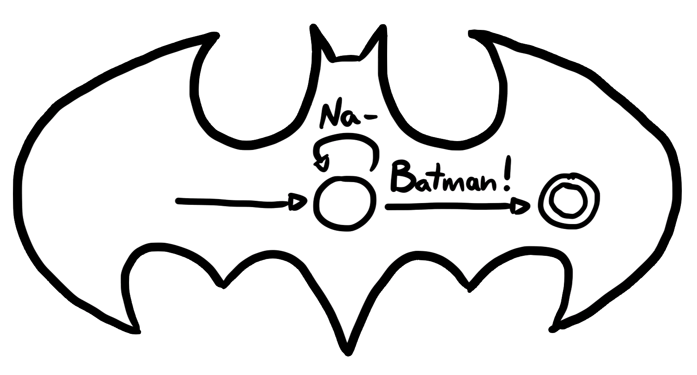

<!--  -->

*Nota: Esta versão do artigo é um rascunho e está incompleta!*

As expressões regulares, também chamadas de *RegEx*, compõem uma ferramenta extremamente útil no arsenal de todo programador. Usando uma curta sequência de símbolos, podemos definir padrões complexos para a realização de buscas e identificação de cadeias de caracteres em textos largos. Mas, você sabia que elas estão fortemente ligadas à noção de "o que é **computação**" e ao trabalho de pesquisa de grandes nomes como Alan Turing e Noam Chomsky?

Neste post, veremos de onde vêm as expressões regulares e como implementá-las a partir de suas bases teóricas, explorando um pouco da área de **teoria da computação**. O conteúdo apresentado é baseado no livro *Introduction to the Theory of Computation* de Michael Sipser, cuja leitura recomendo veementemente caso tenha se interessado no tópico; e também baseado nas aulas da disciplina [Autômatos, Computabilidade e Complexidade (MAC0414)](https://uspdigital.usp.br/jupiterweb/obterDisciplina?sgldis=mac0414) do IME-USP.

## Modelo computacional

> *"Se você deseja assar uma torta do zero, você precisa antes inventar o universo."* - **Carl Sagan**

Para implementarmos expressões regulares, devemos antes inventar o computador. No entanto, não vamos realmente discutir todas as peças necessárias para a criação de um computador moderno, como o processador, a placa gráfica, as interfaces de entrada e saída...

Em vez disso, temos o interesse em modelar apenas o funcionamento básico de tais instrumentos, definindo quais são as operações fundamentais que um computador pode realizar em sua estrutura mais simples. Chamamos de *modelo computacional* toda maneira idealizada de representar computadores dentro da matemática, tendo como exemplo a famosa *máquina de Turing*, citada mais para frente.

## Autômato finito determinístico (DFA)

Um dos modelos computacionais mais simples é o **autômato finito**. A estrutura de um autômato é baseada em três componentes:

- Uma *fita*, que serve como a entrada de dados para este computador simples;
- Um conjunto de *estados*, que representa etapas de computação;
- Uma *função de transição*, que descreve como o computador deve alterar estados com base nos valores lidos da fita.

Nosso computador conceitual deverá percorrer os itens desta fita sequencialmente, lendo cada um deles e realizando uma ação com base em suas regras predeterminadas.

Imagine que estamos modelando o sistema computacional de uma porta eletrônica, capaz de fechar quando apertamos um botão e abrir quando apertamos outro. Dentro da ideia de autômato finito descrita acima, podemos modelar este sistema da seguinte forma:

- A fita é composta por uma sequência de comandos de **abre** ou **fecha**.
- Os estados da porta devem ser **aberto** ou **fechado**.
- As transições entre estados são definidas da seguinte forma: um comando de **abre** deve causar a porta a ficar **aberta**, um comando de **fecha** deve transitar ao estado de **fechado**.

Vamos ver a representação de *diagrama de estados* do sistema acima. Para facilitar o desenho, representamos os estados de **aberto** e **fechado** pelas letras **A** e **F** respectivamente.

<div style="overflow-x: auto; overflow-y: hidden;">
<svg width="350" height="100" style="display: block; margin: auto;" version="1.1" xmlns="http://www.w3.org/2000/svg">
	<ellipse  stroke-width="1" fill="none" cx="119.5" cy="52.5" rx="30" ry="30"/>
	<text x="112.5" y="58.5" font-family="Times New Roman" font-size="20">A</text>
	<ellipse  stroke-width="1" fill="none" cx="226.5" cy="52.5" rx="30" ry="30"/>
	<text x="220.5" y="58.5" font-family="Times New Roman" font-size="20">F</text>
	<path  stroke-width="1" fill="none" d="M 144.662,36.507 A 77.724,77.724 0 0 1 201.338,36.507"/>
	<polygon  stroke-width="1" points="201.338,36.507 195.712,28.934 192.066,38.246"/>
	<text x="151.5" y="22.5" font-family="Times New Roman" font-size="20">fecha</text>
	<path  stroke-width="1" fill="none" d="M 198.688,63.492 A 108.752,108.752 0 0 1 147.312,63.492"/>
	<polygon  stroke-width="1" points="147.312,63.492 153.904,70.24 156.266,60.523"/>
	<text x="155.5" y="87.5" font-family="Times New Roman" font-size="20">abre</text>
	<path  stroke-width="1" fill="none" d="M 92.703,65.725 A 22.5,22.5 0 1 1 92.703,39.275"/>
	<text x="12.5" y="58.5" font-family="Times New Roman" font-size="20">abre</text>
	<polygon  stroke-width="1" points="92.703,39.275 89.17,30.527 83.292,38.618"/>
	<path  stroke-width="1" fill="none" d="M 253.297,39.275 A 22.5,22.5 0 1 1 253.297,65.725"/>
	<text x="299.5" y="58.5" font-family="Times New Roman" font-size="20">fecha</text>
	<polygon  stroke-width="1" points="253.297,65.725 256.83,74.473 262.708,66.382"/>
</svg>
</div>

Isto é *quase* um autômato finito, como logo veremos, mas ilustra bem a ideia geral. Neste tipo de diagrama, representamos os estados do autômato usando círculos e as transições com setas. Um computador com esta definição, que comece no estado **A** e processe uma fita contendo os comandos `[fecha, abre, abre]`, nesta ordem, deverá transitar entre os estados **F**, **A**, e **A** (note que uma porta aberta permanece igual quando recebe o comando `abre`).

Nos resta adicionar dois conceitos para completar a definição de um autômato finito: um autômato deve conter um estado de *início*, indicado por uma seta cuja origem não seja outro estado; e conter estados de *terminação* (ou *aceitação*), indicados por um círculo adicional interno. O estado de início é auto-explicativo, já os estados de terminação são um pouco mais complicados.

O modelo computacional que definimos deve ser capaz de *aceitar* ou *rejeitar* as fitas que recebe como entrada: se seu último estado antes do fim da fita for um estado de terminação, a fita é aceita, caso contrário é rejeitada. Dizemos que a **linguagem** de um autômato é o conjunto de todas as fitas que aceita. Isto não é muito importante para o exemplo dado acima, afinal, toda sequência de apertos de botão para controlar uma porta é válida; no entanto, esta noção será fundamental para entender expressões regulares.

O autômato finito abaixo é uma versão completa do sistema controlador de uma porta eletrônica. Ele aceita todas as possíveis entradas que recebe, como `[abre]`, `[fecha]`, `[abre, fecha]`, `[fecha, abre]`, etc. Desta forma, sua linguagem é o conjunto de todas as suas fitas.

<div style="overflow-x: auto; overflow-y: hidden;">
<svg width="350" height="120" style="display: block; margin: auto;" version="1.1" xmlns="http://www.w3.org/2000/svg">
	<ellipse  stroke-width="1" fill="none" cx="119.5" cy="52.5" rx="30" ry="30"/>
	<text x="112.5" y="58.5" font-family="Times New Roman" font-size="20">A</text>
	<ellipse  stroke-width="1" fill="none" cx="119.5" cy="52.5" rx="24" ry="24"/>
	<ellipse  stroke-width="1" fill="none" cx="226.5" cy="52.5" rx="30" ry="30"/>
	<text x="220.5" y="58.5" font-family="Times New Roman" font-size="20">F</text>
	<ellipse  stroke-width="1" fill="none" cx="226.5" cy="52.5" rx="24" ry="24"/>
	<path  stroke-width="1" fill="none" d="M 144.662,36.507 A 77.724,77.724 0 0 1 201.338,36.507"/>
	<polygon  stroke-width="1" points="201.338,36.507 195.712,28.934 192.066,38.246"/>
	<text x="151.5" y="22.5" font-family="Times New Roman" font-size="20">fecha</text>
	<path  stroke-width="1" fill="none" d="M 198.688,63.492 A 108.752,108.752 0 0 1 147.312,63.492"/>
	<polygon  stroke-width="1" points="147.312,63.492 153.904,70.24 156.266,60.523"/>
	<text x="155.5" y="87.5" font-family="Times New Roman" font-size="20">abre</text>
	<path  stroke-width="1" fill="none" d="M 92.703,65.725 A 22.5,22.5 0 1 1 92.703,39.275"/>
	<text x="12.5" y="58.5" font-family="Times New Roman" font-size="20">abre</text>
	<polygon  stroke-width="1" points="92.703,39.275 89.17,30.527 83.292,38.618"/>
	<path  stroke-width="1" fill="none" d="M 253.297,39.275 A 22.5,22.5 0 1 1 253.297,65.725"/>
	<text x="299.5" y="58.5" font-family="Times New Roman" font-size="20">fecha</text>
	<polygon  stroke-width="1" points="253.297,65.725 256.83,74.473 262.708,66.382"/>
	<polygon  stroke-width="1" points="119.5,117.5 119.5,82.5"/>
	<polygon  stroke-width="1" points="119.5,82.5 114.5,90.5 124.5,90.5"/>
</svg>
</div>

Um autômato finito que não possua "ambiguidade", isto é, todos os seus estados possuem exatamente uma seta para cada transição possível, é chamado de **determinístico**. A representação acima é de um autômato finito determinístico, já que existe exatamente uma transição de `abre` e `fecha` para cada estado (`A` e `F`).

Agora, temos bagagem suficiente para definir *o que é* um autômato finito determinístico de maneira formal, isto é, dentro da matemática. Definições formais são úteis para especificar conceitos de forma inequívoca, evitando que pessoas diferentes tenham interpretações distintas de um mesmo assunto. Também vamos aproveitar esta definição como base do programa que escreveremos em breve...

### Definição formal

Um **autômato finito determinístico** $M$ é composto por $(Q, \Sigma, \delta, q_0, F)$, onde:

1. $Q$ é o conjunto de **estados**,

2. $\Sigma$ (dito *sigma*), é o conjunto do **alfabeto**,

3. $\delta : Q \times \Sigma \to Q$, (*delta* de *Q* e *sigma* para *Q*), é a **função de transição**,

4. $q_0 \in Q$ é o **estado inicial**,

5. $F \subseteq Q$ é o **conjunto de estados de terminação**.

Vamos discutir estes itens um por um. Já sabemos que o conjunto de estados representa as etapas de computação nas quais um computador pode estar, mas o que é o *alfabeto*?

O **alfabeto** de um autômato é o conjunto dos símbolos que cada pedaço de sua fita pode conter. No exemplo de sistema de porta eletrônica, os símbolos possíveis de uma fita eram `abre` e `fecha`, mas poderiam ser outros, como as letras `a` e `b`.

A **função de transição** recebe um estado e um símbolo do alfabeto e devolve outro estado. Lembre do diagrama de estados do exemplo: nele, cada seta de transição começava em um estado, tinha um símbolo associado a ela, e terminava em outro estado. Em linguagem matemática, podemos retratar estas setas como:

- $\delta(A, \text{abre}) = A$
- $\delta(A, \text{fecha}) = F$
- $\delta(F, \text{abre}) = A$
- $\delta(F, \text{fecha}) = F$

O **estado inicial** é nada mais que um dos estados do conjunto de estados, como indicado pela relação de pertencimento $q_0 \in Q$. De forma semelhante, o **conjunto de estados de terminação** é um *subconjunto* de $Q$, ou seja, é um conjunto de estados tal que todos os seus elementos também estão em $Q$.

Tendo uma especificação de autômatos finitos bem definida, podemos traduzí-la em um programa. Antes disso, vamos ver o básico da linguagem de programação usada pelo resto do post.

## Básicos de Haskell

Todo o código deste post estará escrito na linguagem Haskell. Não se preocupe se nunca tiver tido contato com ela: vamos explicar sua sintaxe e seu funcionamento de forma breve. Você pode testar o código deste post sem baixar o compilador da linguagem pelo [Haskell Playground](https://play.haskell.org/). No final do post, colocamos todo o código relevante junto em um bloco. A seção a seguir é uma breve introdução à linguagem; se você já tiver experiência, siga para a próxima seção.

Em linguagens de programação do paradigma funcional como Haskell, a principal unidade de construção é a função. Programas serão, então, a composição de várias funções. Veja o seguinte exemplo de uma função que escolhe o primeiro de dois números inteiros:

```haskell
firstInt :: Int -> Int -> Int
firstInt a b = a
```

A primeira linha é a **assinatura de tipo** da função. O tipo de uma função sempre será uma sequência de tipos alternados por setas `->`, sendo o último tipo a saída da função, e os outros são os parâmetros. Os parâmetros de funções não precisam estar entre parênteses, somente estarão quando necessário para evitar ambiguidade.

Os parâmetros e resultado de uma função também podem ser de tipos genéricos. Quando um tipo em uma assinatura começar com letra minúscula, ele será uma **variável de tipo**, cuja instanciação no geral pode ser inferida pelo compilador:

```haskell
first :: a -> b -> a
first a b = a

numberOne :: Int
numberOne = first 1 "Hi!"
```

Funções também podem ser passadas por parâmetro para outras funções:

```haskell
doFunction :: (a -> b) -> a -> b
doFunction f a = f a
```

Podemos também criar **tipos de dados**, que armazenam dados. Há duas principais maneiras de se criar tipos: usando **produto** e **soma**. O produto se assemelha às *structs* de linguagens imperativas, permitindo que um tipo guarde dois ou mais outros tipos:

```haskell
-- Produto sem nomes
data Person = MkPerson Int String

-- Produto com nomes
data Person = MkPerson
  { id :: Int,
    name :: String,
  }
```

Já a soma de tipos define um valor que vai conter, exclusivamente, *ou* um tipo, *ou* outro. Cada *variante* deve possuir um nome, que será seu *construtor*. O tipo de produto `Person` só tem uma variante, cujo construtor é `MkPerson`. Veja um tipo para valores opcionais usando soma:

```haskell
data Option a = Some a | None
```

Os valores guardados em tipos de soma e de produto podem ser extraídos usando *pattern matching* em seus construtores:

```haskell
getPersonName :: Person -> String
getPersonName (MkPerson id name) = name

getSome :: Option a -> a
getSome (Some v) = v
getSome None = error "`Option` vazio"
```

Haskell é muito diferente de linguagens imperativas tradicionais. Poderíamos falar muito mais sobre a linguagem, mas para entender este post, os conceitos acima devem ser suficientes. Se quiser aprofundar, recomendo a leitura de [Read World Haskell](https://book.realworldhaskell.org/), de Bryan O'Sullivan, Don Stewart, e John Goerzen.

## Autômato finito determinístico em Haskell

A seguir, vamos finalmente representar autômatos em Haskell. Os conjuntos de estado e do alfabeto serão representados como tipos genéricos. Já o conjunto de terminação será representado desta forma:

```haskell
type Set a = a -> Bool

contains :: Set a -> a -> Bool
contains set element = set element
```

Este tipo é uma abreviação para uma função genérica em `a` que retorna verdadeiro se o elemento de `a` estiver no conjunto, e falso caso contrário.  Desta forma, nossos conjuntos serão representados pela *função característica*.

Podemos representar nosso autômato finito da seguinte forma. O tipo criado abaixo tem como nome `DFA`, que vem do inglês *deterministic finite automaton*.

```haskell
data DFA state symbol = MkDFA
  { transitionDfa :: state -> symbol -> state,
    startDfa :: state,
    endDfa :: Set state
  }
```

Acima, criamos um tipo chamado `DFA` que é genérico em outros dois tipos: `state` e `symbol`, que representam os estados ($Q$) e alfabeto ($\Sigma$) respectivamente. Desta forma, para que um DFA seja criado, precisamos informar qual serão os estados e o alfabeto usado, como veremos em um exemplo daqui a pouco. Note também que em nosso programa, $Q$ e $\Sigma$ não são conjuntos, e sim *tipos*[^1]. Isto significa que precisamos obrigatoriamente fornecer os estados e o alfabeto em tempo de compilação, isto é, ao definir um `DFA`.

[^1]: Tipos e conjuntos são maneiras de formar coleções de elementos. Na prática, tipos na programação definem limites em tempo de compilação (por exemplo, o tipo `int` força um programador a usar somente números inteiros em tempo de compilação), e os elementos de conjuntos existem em tempo de execução. Na matemática, esta diferença é mais complicada: tipos estão relacionados a como construímos seus elementos, e conjuntos agrupam seus elementos (assumidos pré-existentes) a partir de suas propriedades. Esta discussão é extensa e foge do propósito deste post; se quiser saber mais, veja [este link](https://cs.stackexchange.com/questions/91330/what-exactly-is-the-semantic-difference-between-set-and-type).

Valores do tipo `DFA` podem ser criados usando a função construtora `MkDFA` (diz-se "*make DFA*"). Como atributos, um `DFA` deve ter:

- Uma função de transição ($\delta$) chamada `transitionDfa`, que recebe um estado e um símbolo e retorna outro estado.
- Um estado de início ($q_0$) chamado `startDfa`,
- Um conjunto de estados de terminação ($F$) chamado `endDfa`.

Lembre do exemplo da porta eletrônica. Vamos representá-lo em Haskell!

```haskell
data DoorState  = Open   | Closed deriving (Eq, Show)
data DoorSymbol = DoOpen | DoClose
```

Neste bloco, criamos um tipo `DoorState`, que representa os estados nos quais uma porta pode estar e cujos valores podem ser ou `Open` ou `Closed`. Também criamos um tipo `DoorSymbol`, que configura o alfabeto do exemplo e é habitado por `DoOpen` e `DoClose`. O trecho `deriving (Eq, Ord)` permite que valores de `DoorState` possam ser comparados por igualdade e possam ser transformados em texto.

Definimos o autômato do exemplo da seguinte forma:

```haskell
example1 :: DFA DoorState DoorSymbol
example1 = MkDFA transition start end
  where
    transition :: DoorState -> DoorSymbol -> DoorState
    transition Open   DoOpen  = Open
    transition Open   DoClose = Closed
    transition Closed DoOpen  = Open
    transition Closed DoClose = Closed
    start :: DoorState
    start = Open
    end :: Set DoorState
    end state = state `elem` [Open, Closed]
```

Acima, criamos um valor de `DFA` parametrizado pelos tipos `DoorState` e `DoorSymbol`, usando os membros `transition`, `start`, e `endings` definidos após a cláusula `where`.

A função `transition` é definida usando a técnica de *pattern matching* em cima de seus parâmetros: quando recebe um valor `Open` e um `DoOpen`, retorna `Open`; quando recebe `Open` e `DoClose`, retorna `Closed`; e assim por diante. `start` é nada mais que o estado no qual o sistema começa e `end` é um conjunto que retorna verdadeiro para cada elemento na lista `[Open, Closed]`. Funções entre *backticks* (\`) são consideradas *infixas*, isto é, são escritas entre seus parâmetros, de forma que `elem state [Open, Closed]` seja igual a ``state `elem` [Open, Closed]``.

## Linguagens regulares

Até este momento, estávamos pensando em autômatos como um modelo abstrato para sistemas concretos; a partir de agora, vamos focar um pouco mais nas abstrações, com os holofotes no conceito de *linguagem* brevemente mencionado.

A linguagem de um modelo computacional baseado em *aceitação* e *rejeição*, como discutido, é o conjunto de todas as entradas que, no final de sua computação, acabam em um estado de aceitação. Por definição, as **linguagens regulares** são todas as linguagens que podem ser descritas por um autômato finito determinístico. Se o autômato $M$ aceita exatamente todas as fitas (ou *strings*) da linguagem $A$, dizemos que $M$ reconhece $A$.

Imagine que estamos lidando com uma fita cujo alfabeto contêm somente as letras 'a' e 'b'. O conjunto de todas as fitas possíveis com esta característica seria:

$$\{\text{`` ''}, \text{``a''}, \text{``b''}, \text{``aa''}, \text{``ab''}, \text{``ba''}, \text{``bb''},  \text{``aaa''}, \text{``aab''}, \text{...}\}$$

Desta forma, qualquer autômato que tenha ao menos um estado e que todos sejam de aceitação terá este conjunto como linguagem. Mas, e se quisermos adicionar alguma restrição? Abaixo, vemos o diagrama de estados de um autômato cuja linguagem contêm *apenas* as fitas que tenham um número par de aparições da letra 'a' e qualquer número da letra 'b'.

<div style="overflow-x: auto; overflow-y: hidden;">
<svg width="215" height="150" style="display: block; margin: auto;" version="1.1" xmlns="http://www.w3.org/2000/svg">
	<ellipse  stroke-width="1" fill="none" cx="64.5" cy="45.5" rx="30" ry="30"/>
	<text x="56.5" y="51.5" font-family="Times New Roman" font-size="20">q&#8320;</text>
	<ellipse  stroke-width="1" fill="none" cx="64.5" cy="45.5" rx="24" ry="24"/>
	<ellipse  stroke-width="1" fill="none" cx="182.5" cy="45.5" rx="30" ry="30"/>
	<text x="174.5" y="51.5" font-family="Times New Roman" font-size="20">q&#8321;</text>
	<path  stroke-width="1" fill="none" d="M 91.733,33.135 A 110.786,110.786 0 0 1 155.267,33.135"/>
	<polygon  stroke-width="1" points="155.267,33.135 149.037,26.051 146.17,35.631"/>
	<text x="119.5" y="19.5" font-family="Times New Roman" font-size="20">a</text>
	<path  stroke-width="1" fill="none" d="M 77.725,72.297 A 22.5,22.5 0 1 1 51.275,72.297"/>
	<text x="59.5" y="134.5" font-family="Times New Roman" font-size="20">b</text>
	<polygon  stroke-width="1" points="51.275,72.297 42.527,75.83 50.618,81.708"/>
	<path  stroke-width="1" fill="none" d="M 195.725,72.297 A 22.5,22.5 0 1 1 169.275,72.297"/>
	<text x="177.5" y="134.5" font-family="Times New Roman" font-size="20">b</text>
	<polygon  stroke-width="1" points="169.275,72.297 160.527,75.83 168.618,81.708"/>
	<path  stroke-width="1" fill="none" d="M 154.146,55.125 A 140.25,140.25 0 0 1 92.854,55.125"/>
	<polygon  stroke-width="1" points="92.854,55.125 99.568,61.752 101.753,51.993"/>
	<text x="119.5" y="79.5" font-family="Times New Roman" font-size="20">a</text>
	<polygon  stroke-width="1" points="2.5,45.5 34.5,45.5"/>
	<polygon  stroke-width="1" points="34.5,45.5 26.5,40.5 26.5,50.5"/>
</svg>
</div>

<!-- <div style="overflow-x: auto; overflow-y: hidden;"> -->
$$\{\text{`` ''}, \text{``b''}, \text{``aa''}, \text{``aab''}, \text{``baa''}, \text{``aabb''}, \text{``baab''}, \text{``bbaa''},  \text{``aaaa''}, \text{...}\}$$
<!-- </div> -->

Em código, escrevemos este autômato como:

```haskell
data Q = Q1 | Q2 deriving (Eq, Show)
data S = A | B

example2 :: DFA Q S
example2 = MkDFA transition start end
  where
    transition :: Q -> S -> Q
    transition Q1 A = Q2
    transition Q2 A = Q1
    transition q B = q
    start :: Q
    start = Q1
    end :: Set Q
    end state = state == Q1
```

Podemos usar o programa que descreve este autômato para verificar, de forma automática, se uma string pertence à sua linguagem; mas a questão é, como fazemos isso?

Precisamos escrever uma função que percorre os estados do modelo, transitando entre eles a partir das regras da função de transição. Em pseudo-código de uma linguagem imperativa tradicional, faríamos algo similar a isto:

```text
run(transition, start, tape):
  state <- start
  for symbol in tape:
    state <- transition(state, symbol)
  return state
```

Este padrão de código é muito comum, e na programação funcional o chamamos de **fold** (dobra), já que seu comportamento é de "dobrar" sua entrada aos poucos até terminar com um único valor final. Em Haskell, a assinatura do `fold` dobrando elementos da esquerda para a direita é a seguinte:

```haskell
foldl :: (b -> a -> b) -> b -> [a] -> b
```

`foldl` recebe uma função que acumulará o estado atual de tipo genérico `b` com o valor atual na fita de tipo genérico `a`, recebe também um estado inicial do tipo `b`, e uma lista de elementos do tipo `a`. No final, `foldl` retorna o resultado desta acumulação para cada elemento da lista.

A partir desta definição, a função que executa um autômato finito `dfa` com uma fita `tape` pode ser escrita assim:

```haskell
runDfa :: DFA state symbol -> [symbol] -> state
runDfa dfa tape = foldl (transitionDfa dfa) (startDfa dfa) tape
```

Os trechos `(transition dfa)` e `(start dfa)` extraem a função de transição e o estado inicial de um autômato, respectivamente. Lembre que o tipo da função de transição é `state -> symbol -> state`, portanto, encaixa no tipo `b -> a -> b`. Após o fim da execução, precisamos saber se o estado final é de aceitação para descobrir se uma dada fita é parte da linguagem do autômato:

```haskell
acceptsDfa :: DFA state symbol -> [symbol] -> Bool
acceptsDfa dfa tape = endDfa dfa `contains` runDfa dfa tape
```

A função acima verifica se o estado final é membro do conjunto de estados de terminação.

Para testar as funções que acabamos de definir com alguns exemplos, definimos a função *main* de entrada do programa que imprime alguns resultados:

```haskell
main = do
  print (runDfa example2 [A, A, B, A, B, A]) -- imprime Q1
  print (runDfa example2 [A, A, B, A, B, B]) -- imprime Q2
  print (example2 `acceptsDfa` [A, A, B, A, B, A]) -- imprime True
  print (example2 `acceptsDfa` [A, A, B, A, B, B]) -- imprime False
```

Vamos ver um exemplo mais próximo do objetivo final de expressões regulares. Imagine que queremos formar um sistema capaz de decidir se uma palavra (ou uma *string*) é igual a "casa" ou "carro". Como vimos anteriormente, uma linguagem regular é o conjunto de entradas aceita por um autômato. Desta forma, vamos construir um autômato determinístico finito cuja linguagem é $\{\text{``casa''}, \text{``carro''}\}$. Seu alfabeto é composto por todas as letras da língua portuguesa. Portanto, todo estado deverá conter 26 transições -- uma para cada letra.

<div style="overflow-x: auto; overflow-y: hidden;">
<svg width="700" height="350" style="display: block; margin: auto" version="1.1" xmlns="http://www.w3.org/2000/svg">
	<ellipse stroke-width="1" fill="none" cx="106.5" cy="77.5" rx="30" ry="30"/>
	<text x="97.5" y="83.5" font-family="Times New Roman" font-size="20">q&#8320;</text>
	<ellipse stroke-width="1" fill="none" cx="214.5" cy="77.5" rx="30" ry="30"/>
	<text x="205.5" y="83.5" font-family="Times New Roman" font-size="20">q&#8321;</text>
	<ellipse stroke-width="1" fill="none" cx="321.5" cy="77.5" rx="30" ry="30"/>
	<text x="312.5" y="83.5" font-family="Times New Roman" font-size="20">q&#8322;</text>
	<ellipse stroke-width="1" fill="none" cx="399.5" cy="46.5" rx="30" ry="30"/>
	<text x="390.5" y="52.5" font-family="Times New Roman" font-size="20">q&#8323;</text>
	<ellipse stroke-width="1" fill="none" cx="106.5" cy="227.5" rx="30" ry="30"/>
	<text x="93.5" y="233.5" font-family="Times New Roman" font-size="20">fail</text>
	<ellipse stroke-width="1" fill="none" cx="399.5" cy="124.5" rx="30" ry="30"/>
	<text x="390.5" y="130.5" font-family="Times New Roman" font-size="20">q&#8324;</text>
	<ellipse stroke-width="1" fill="none" cx="502.5" cy="46.5" rx="30" ry="30"/>
	<text x="493.5" y="52.5" font-family="Times New Roman" font-size="20">q&#8325;</text>
	<ellipse stroke-width="1" fill="none" cx="502.5" cy="46.5" rx="24" ry="24"/>
	<ellipse stroke-width="1" fill="none" cx="502.5" cy="124.5" rx="30" ry="30"/>
	<text x="493.5" y="130.5" font-family="Times New Roman" font-size="20">q&#8326;</text>
	<ellipse stroke-width="1" fill="none" cx="604.5" cy="124.5" rx="30" ry="30"/>
	<text x="595.5" y="130.5" font-family="Times New Roman" font-size="20">q&#8327;</text>
	<ellipse stroke-width="1" fill="none" cx="604.5" cy="124.5" rx="24" ry="24"/>
	<polygon stroke-width="1" points="40.5,77.5 76.5,77.5"/>
	<polygon fill="black" stroke-width="1" points="76.5,77.5 68.5,72.5 68.5,82.5"/>
	<polygon stroke-width="1" points="136.5,77.5 184.5,77.5"/>
	<polygon fill="black" stroke-width="1" points="184.5,77.5 176.5,72.5 176.5,82.5"/>
	<text x="156.5" y="98.5" font-family="Times New Roman" font-size="20">c</text>
	<polygon stroke-width="1" points="244.5,77.5 291.5,77.5"/>
	<polygon fill="black" stroke-width="1" points="291.5,77.5 283.5,72.5 283.5,82.5"/>
	<text x="263.5" y="98.5" font-family="Times New Roman" font-size="20">a</text>
	<polygon stroke-width="1" points="349.379,66.42 371.621,57.58"/>
	<polygon fill="black" stroke-width="1" points="371.621,57.58 362.34,55.888 366.033,65.181"/>
	<text x="348.5" y="52.5" font-family="Times New Roman" font-size="20">s</text>
	<polygon stroke-width="1" points="106.5,107.5 106.5,197.5"/>
	<polygon fill="black" stroke-width="1" points="106.5,197.5 111.5,189.5 101.5,189.5"/>
	<text x="27.5" y="158.5" font-family="Times New Roman" font-size="20">a, b, d, ...</text>
	<polygon stroke-width="1" points="196.971,101.846 124.029,203.154"/>
	<polygon fill="black" stroke-width="1" points="124.029,203.154 132.761,199.583 124.646,193.74"/>
	<text x="166.5" y="172.5" font-family="Times New Roman" font-size="20">b, c, d, ...</text>
	<path stroke-width="1" fill="none" d="M 311.516,105.762 A 204.592,204.592 0 0 1 136.471,227.887"/>
	<polygon fill="black" stroke-width="1" points="136.471,227.887 144.758,232.394 144.154,222.413"/>
	<path stroke-width="1" fill="none" d="M 390.106,74.972 A 250.305,250.305 0 0 1 136.166,231.843"/>
	<polygon fill="black" stroke-width="1" points="136.166,231.843 143.71,237.508 144.563,227.544"/>
	<polygon stroke-width="1" points="347.196,92.983 373.804,109.017"/>
	<polygon fill="black" stroke-width="1" points="373.804,109.017 369.533,100.605 364.372,109.17"/>
	<text x="365.5" y="91.5" font-family="Times New Roman" font-size="20">r</text>
	<polygon stroke-width="1" points="429.5,46.5 472.5,46.5"/>
	<polygon fill="black" stroke-width="1" points="472.5,46.5 464.5,41.5 464.5,51.5"/>
	<text x="446.5" y="37.5" font-family="Times New Roman" font-size="20">a</text>
	<polygon stroke-width="1" points="429.5,124.5 472.5,124.5"/>
	<polygon fill="black" stroke-width="1" points="472.5,124.5 464.5,119.5 464.5,129.5"/>
	<text x="447.5" y="115.5" font-family="Times New Roman" font-size="20">r</text>
	<path stroke-width="1" fill="none" d="M 381.982,148.832 A 250.504,250.504 0 0 1 135.39,235.517"/>
	<polygon fill="black" stroke-width="1" points="135.39,235.517 142.167,242.081 144.259,232.302"/>
	<path stroke-width="1" fill="none" d="M 491.435,74.371 A 299.359,299.359 0 0 1 134.816,237.372"/>
	<polygon fill="black" stroke-width="1" points="134.816,237.372 141.085,244.421 143.9,234.826"/>
	<path stroke-width="1" fill="none" d="M 485.785,149.396 A 291.95,291.95 0 0 1 133.227,241.097"/>
	<polygon fill="black" stroke-width="1" points="133.227,241.097 138.499,248.921 142.569,239.787"/>
	<polygon stroke-width="1" points="532.5,124.5 574.5,124.5"/>
	<polygon fill="black" stroke-width="1" points="574.5,124.5 566.5,119.5 566.5,129.5"/>
	<text x="548.5" y="115.5" font-family="Times New Roman" font-size="20">o</text>
	<path stroke-width="1" fill="none" d="M 585.883,148.015 A 378.412,378.412 0 0 1 132.917,241.701"/>
	<polygon fill="black" stroke-width="1" points="132.917,241.701 137.917,249.701 142.299,240.712"/>
	<path stroke-width="1" fill="none" d="M 119.725,254.297 A 22.5,22.5 0 1 1 93.275,254.297"/>
	<text x="99.5" y="316.5" font-family="Times New Roman" font-size="20">...</text>
	<polygon fill="black" stroke-width="1" points="93.275,254.297 84.527,257.83 92.618,263.708"/>
</svg>
</div>

No autômato acima, as transições com mais de um símbolo do alfabeto representam múltiplas transições, uma para cada símbolo. As transições com reticiências retratam ou todos os caracteres possíveis, ou todos os caracteres não incluídos em outras transições. Para que possamos lidar com palavras que não são nem "casa" nem "carro", precisamos adicionar um estado de "falha", do qual não é possível escapar.

Abaixo, temos a representação em Haskell deste mesmo autômato.

```haskell
example3 :: DFA String Char
example3 = MkDFA transition start end
  where
    transition :: String -> Char -> String
    transition "q0"  'c' = "q1"
    transition "q1"  'a' = "q2"
    transition "q2"  's' = "q3"
    transition "q2"  'r' = "q4"
    transition "q3"  'a' = "q5"
    transition "q4"  'r' = "q6"
    transition "q6"  'o' = "q7"
    transition "q0"   _  = "fail"
    transition "q1"   _  = "fail"
    transition "q2"   _  = "fail"
    transition "q3"   _  = "fail"
    transition "q4"   _  = "fail"
    transition "q6"   _  = "fail"
    transition "fail" _  = "fail"
    transition   _    _  = "fail"
    start :: String
    start = "q0"
    end :: Set String
    end state = state `elem` ["q5", "q7"]
```

Novamente, usamos *pattern matching* para representar as transições. Os padrões com *underscore* `_` significam "todos os outros casos". Por exemplo, a linha `transition "q0" _ = "fail"` significa "transições de `"q0"` com qualquer símbolo além de `'c'` (definido anteriormente) resultará em `"fail"`".

Note que o conjunto de estados de `example3` é o conjunto de *todas* as strings, e o alfabeto é o conjunto de *todos* os caracteres. Então, tecnicamente qualquer string é válida como estado, e qualquer caracter é válido como transição. Para evitar problemas, colocamos a linha `transition _ _ = "fail"`, levando qualquer estado ou transição indesejada ao estado de falha.

A seguir, podemos verificar que "casa" e "carro" realmente são aceitos pelo autômato, e "calo" não é. Caso esteja acompanhando o código no Haskell Playground, apague a outra definição de função `main` para evitar repetição de definições. Perceba que o segundo parâmetro de `accepts` é uma lista de caracteres `List Char`. Em Haskell, o tipo `String` é definido como `List Char`, e portanto podemos usar a notação usual de strings.

```haskell
main = do
  print (example3 `acceptsDfa` "casa")  -- imprime True
  print (example3 `acceptsDfa` "carro") -- imprime True
  print (example3 `acceptsDfa` "calo")  -- imprime False
```

## Operações em linguagens

Conforme trilhamos o caminho até as expressões regulares, vamos voltar a discutir linguagens regulares. Vamos ver agora as **operações** que podemos realizar para compor linguagens.

Dadas as linguagens regulares $A$ e $B$, as seguintes operações resultam em outras linguagens:

- **União**: $A \cup B = \{ x \mid x \in A \text{ ou } x \in B \}$
- **Concatenação**: $A \circ B = \{ x y \mid x \in A \text{ e } y \in B \}$
- **Estrela**: $A^* = \{ x_1 x_2 \ldots x_k \mid k \geq 0 \text{ e cada } x_i \in A \}$

A união é simples: a união de $A$ e $B$ é a linguagem que tem exatamente os mesmos elementos que estão em $A$ ou que estão em $B$. Por exemplo:

$$\{ \text{``casa''}, \text{``carro''} \} \cup \{ \text{``joia''}, \text{``boia''} \} = \{ \text{``casa''}, \text{``carro''}, \text{``joia''}, \text{``boia''} \}$$

A concatenação de $A$ e $B$ junta cada elemento de $A$ à esquerda a cada elemento de $B$ à direita. Por exemplo:

$$\{ \text{``casa''}, \text{``carro''} \} \circ \{ \text{``joia''}, \text{``boia''} \} = \{ \text{``casajoia''}, \text{``casaboia''}, \text{``carrojoia''}, \text{``carroboia''} \}$$

A estrela de $A$, também chamada de *Kleene star*, é uma operação unária. Ela anexa qualquer número de *strings* em $A$, incluindo 0, e seu resultado é a linguagem de todas os anexos possíveis. Veja o exemplo a seguir. Note que sempre que $A$ não for o conjunto vazio, $A^*$ será um conjunto infinito.

$$\{ \text{``a''}, \text{``b''}, \text{``c''} \}^* = \{ \text{`` ''}, \text{``a''}, \text{``b''}, \text{``c''}, \text{``aa''}, \text{``ab''}, \text{``ac''}, \text{``ba''}, \text{``bb''}, \text{``bc''}, \text{``ca''}, \text{``cb''}, \text{``cc''}, \text{``aaa''}, \text{``aab''}, \text{...}\} $$ 

## Operações regulares

Uma pergunta natural decorrente das operações acima é ***será que o resultado de cada uma destas operações também é uma linguagem regular?***

Lembre que a definição de linguagem regular é "uma linguagem reconhecida por um autômato finito determinístico". Portanto, uma maneira de demonstrar que o resultado dessas operações é regular é simplesmente construir autômatos finitos determinísticos que as realizam. Um bônus adicional desta abordagem é que, além de provarmos que as operações são regulares, nós também teremos uma maneira de *computar* (ou *construir*) estas operações. Demonstrações matemáticas deste estilo são chamadas de *provas por construção*. As provas que faremos neste post não podem ser chamadas de provas *formais*, pois não são realizadas com todo o rigor matemático. Para provas com mais rigor, dê uma olhada no livro *Introduction to the Theory of Computation* de Michael Sipser.

### União

Suponha que o autômato $M_1 = (Q_1, \Sigma, \delta_1, q_1, F_1)$ reconhece a linguagem $A_1$, e o autômato $M_2 = (Q_2, \Sigma, \delta_2, q_2, F_2)$ reconhece a linguagem $A_2$. A ideia da nossa construção será juntar todos os estados de $Q_1$ e $Q_2$ par-a-par, formando o *produto cartesiano*:

$$Q_1 \times Q_2 = \{ (r_1, r_2) \mid r_1 \in Q_1 \text{ e } r_2 \in Q_2 \}$$

Desta forma, cada estado do autômato resultante será um par com um estado de $Q_1$ e um estado de $Q_2$. Cada transição de $\delta_1$ de $r_a$ para $r_b$ será atualizada para levar de um estado com $r_a$ à esquerda a outro estado com $r_b$ na esquerda, e equivalentemente para as transições de $\delta_2$, mas para a direita. Desta forma, simulamos a execução dos dois autômatos simultaneamente. O estado inicial do novo autômato será o estado que contêm o par $(q_1, q_2)$, e os estados finais serão todos os estados que contêm ou um estado de terminação de $M_1$, ou um estado de terminação de $M_2$.

Assim, o autômato $M = (Q, \Sigma, \delta, q_0, F)$ que reconhece $A_1 \cup A_2$ terá os seguintes elementos:

- $Q = Q_1 \times Q_2$
- $\Sigma$ se mantêm, já que o alfabeto de $M_1$ e $M_2$ são iguais.
  - Caso $M_1$ tivesse alfabeto $\Sigma_1$ e $M_2$ tivesse $\Sigma_2$, o alfabeto de $M$ seria $\Sigma = \Sigma_1 \cup \Sigma_2$.
- $\delta((r_1, r_2), a) = (\delta_1(r_1, a), \delta_2(r_2, a))$
  - Isto é: para um símbolo $a$, o estado resultante deve ser o par das transições de $M_1$ e $M_2$.
- $q_0 = (q_1, q_2)$
- $F = \{ (r_1, r_2) \mid r_1 \in F_1 \text{ ou } r_2 \in F_2 \} = (F_1 \times Q_2) \cup (Q_1 \times F_2)$

Uma prova formal de que $A_1 \cup A_2$ é regular deveria argumentar usando alguma ferramenta rigorosa como indução que o autômato $M$ realmente reconhece $A_1 \cup A_2$. Neste post, ficaremos apenas na intuição.

Vejamos um exemplo. Abaixo, temos o autômato $M_1$ que reconhece a linguagem $\{ \text{``do''} \}$, e depois o autômato $M_2$ que reconhece $\{ \text{``re''} \}$.

<div style="overflow-x: auto; overflow-y: hidden;">
<svg width="400" height="250" style="display: block; margin: auto" version="1.1" xmlns="http://www.w3.org/2000/svg">
	<text x="0.5" y="22.5" font-family="Times New Roman" font-size="20">M&#8321;</text>
	<ellipse stroke-width="1" fill="none" cx="88.5" cy="69.5" rx="30" ry="30"/>
	<text x="79.5" y="75.5" font-family="Times New Roman" font-size="20">a&#8320;</text>
	<ellipse stroke-width="1" fill="none" cx="88.5" cy="187.5" rx="30" ry="30"/>
	<text x="81.5" y="193.5" font-family="Times New Roman" font-size="20">f&#8321;</text>
	<ellipse stroke-width="1" fill="none" cx="199.5" cy="69.5" rx="30" ry="30"/>
	<text x="190.5" y="75.5" font-family="Times New Roman" font-size="20">a&#8321;</text>
	<ellipse stroke-width="1" fill="none" cx="307.5" cy="69.5" rx="30" ry="30"/>
	<text x="298.5" y="75.5" font-family="Times New Roman" font-size="20">a&#8322;</text>
	<ellipse stroke-width="1" fill="none" cx="307.5" cy="69.5" rx="24" ry="24"/>
	<polygon stroke-width="1" points="31.5,69.5 58.5,69.5"/>
	<polygon fill="black" stroke-width="1" points="58.5,69.5 50.5,64.5 50.5,74.5"/>
	<polygon stroke-width="1" points="118.5,69.5 169.5,69.5"/>
	<polygon fill="black" stroke-width="1" points="169.5,69.5 161.5,64.5 161.5,74.5"/>
	<text x="139.5" y="60.5" font-family="Times New Roman" font-size="20">d</text>
	<polygon stroke-width="1" points="229.5,69.5 277.5,69.5"/>
	<polygon fill="black" stroke-width="1" points="277.5,69.5 269.5,64.5 269.5,74.5"/>
	<text x="248.5" y="60.5" font-family="Times New Roman" font-size="20">o</text>
	<polygon stroke-width="1" points="88.5,99.5 88.5,157.5"/>
	<polygon fill="black" stroke-width="1" points="88.5,157.5 93.5,149.5 83.5,149.5"/>
	<text x="68.5" y="134.5" font-family="Times New Roman" font-size="20">...</text>
	<polygon stroke-width="1" points="178.945,91.351 109.055,165.649"/>
	<polygon fill="black" stroke-width="1" points="109.055,165.649 118.178,163.247 110.895,156.396"/>
	<text x="123.5" y="119.5" font-family="Times New Roman" font-size="20">...</text>
	<polygon stroke-width="1" points="281.09,83.73 114.91,173.27"/>
	<polygon fill="black" stroke-width="1" points="114.91,173.27 124.325,173.877 119.581,165.073"/>
	<text x="202.5" y="149.5" font-family="Times New Roman" font-size="20">...</text>
</svg>
</div>

<div style="overflow-x: auto; overflow-y: hidden;">
<svg width="400" height="280" style="display: block; margin: auto" version="1.1" xmlns="http://www.w3.org/2000/svg">
	<text x="0.5" y="22.5" font-family="Times New Roman" font-size="20">M&#8322;</text>
	<ellipse stroke-width="1" fill="none" cx="88.5" cy="69.5" rx="30" ry="30"/>
	<text x="79.5" y="75.5" font-family="Times New Roman" font-size="20">b&#8320;</text>
	<ellipse stroke-width="1" fill="none" cx="88.5" cy="187.5" rx="30" ry="30"/>
	<text x="81.5" y="193.5" font-family="Times New Roman" font-size="20">f&#8322;</text>
	<ellipse stroke-width="1" fill="none" cx="199.5" cy="69.5" rx="30" ry="30"/>
	<text x="190.5" y="75.5" font-family="Times New Roman" font-size="20">b&#8321;</text>
	<ellipse stroke-width="1" fill="none" cx="307.5" cy="69.5" rx="30" ry="30"/>
	<text x="298.5" y="75.5" font-family="Times New Roman" font-size="20">b&#8322;</text>
	<ellipse stroke-width="1" fill="none" cx="307.5" cy="69.5" rx="24" ry="24"/>
	<polygon stroke-width="1" points="31.5,69.5 58.5,69.5"/>
	<polygon fill="black" stroke-width="1" points="58.5,69.5 50.5,64.5 50.5,74.5"/>
	<polygon stroke-width="1" points="118.5,69.5 169.5,69.5"/>
	<polygon fill="black" stroke-width="1" points="169.5,69.5 161.5,64.5 161.5,74.5"/>
	<text x="140.5" y="60.5" font-family="Times New Roman" font-size="20">r</text>
	<polygon stroke-width="1" points="229.5,69.5 277.5,69.5"/>
	<polygon fill="black" stroke-width="1" points="277.5,69.5 269.5,64.5 269.5,74.5"/>
	<text x="249.5" y="60.5" font-family="Times New Roman" font-size="20">e</text>
	<polygon stroke-width="1" points="88.5,99.5 88.5,157.5"/>
	<polygon fill="black" stroke-width="1" points="88.5,157.5 93.5,149.5 83.5,149.5"/>
	<text x="68.5" y="134.5" font-family="Times New Roman" font-size="20">...</text>
	<polygon stroke-width="1" points="178.945,91.351 109.055,165.649"/>
	<polygon fill="black" stroke-width="1" points="109.055,165.649 118.178,163.247 110.895,156.396"/>
	<text x="123.5" y="119.5" font-family="Times New Roman" font-size="20">...</text>
	<polygon stroke-width="1" points="281.09,83.73 114.91,173.27"/>
	<polygon fill="black" stroke-width="1" points="114.91,173.27 124.325,173.877 119.581,165.073"/>
	<text x="202.5" y="149.5" font-family="Times New Roman" font-size="20">...</text>
</svg>
</div>

A união $M = M_1 \cup M_2$ será igual a:

<div style="overflow-x: auto; overflow-y: hidden;">
<svg width="650" height="500" style="display: block; margin: auto" version="1.1" xmlns="http://www.w3.org/2000/svg">
	<text x="30.5" y="42.5" font-family="Times New Roman" font-size="20">M</text>
	<ellipse stroke-width="1" fill="none" cx="136.5" cy="220.5" rx="30" ry="30"/>
	<text x="113.5" y="226.5" font-family="Times New Roman" font-size="20">a&#8320;, b&#8320;</text>
	<ellipse stroke-width="1" fill="none" cx="136.5" cy="65.5" rx="30" ry="30"/>
	<text x="113.5" y="71.5" font-family="Times New Roman" font-size="20">a&#8320;, b&#8321;</text>
	<ellipse stroke-width="1" fill="none" cx="200.5" cy="65.5" rx="30" ry="30"/>
	<text x="177.5" y="71.5" font-family="Times New Roman" font-size="20">a&#8320;, b&#8322;</text>
	<ellipse stroke-width="1" fill="none" cx="200.5" cy="65.5" rx="24" ry="24"/>
	<ellipse stroke-width="1" fill="none" cx="266.5" cy="65.5" rx="30" ry="30"/>
	<text x="245.5" y="71.5" font-family="Times New Roman" font-size="20">a&#8320;, f&#8322;</text>
	<ellipse stroke-width="1" fill="none" cx="136.5" cy="365.5" rx="30" ry="30"/>
	<text x="113.5" y="371.5" font-family="Times New Roman" font-size="20">a&#8321;, b&#8320;</text>
	<ellipse stroke-width="1" fill="none" cx="368.5" cy="65.5" rx="30" ry="30"/>
	<text x="345.5" y="71.5" font-family="Times New Roman" font-size="20">a&#8321;, b&#8321;</text>
	<ellipse stroke-width="1" fill="none" cx="434.5" cy="65.5" rx="30" ry="30"/>
	<text x="411.5" y="71.5" font-family="Times New Roman" font-size="20">a&#8321;, b&#8322;</text>
	<ellipse stroke-width="1" fill="none" cx="434.5" cy="65.5" rx="24" ry="24"/>
	<ellipse stroke-width="1" fill="none" cx="266.5" cy="163.5" rx="30" ry="30"/>
	<text x="245.5" y="169.5" font-family="Times New Roman" font-size="20">a&#8321;, f&#8322;</text>
	<ellipse stroke-width="1" fill="none" cx="200.5" cy="365.5" rx="30" ry="30"/>
	<text x="177.5" y="371.5" font-family="Times New Roman" font-size="20">a&#8322;, b&#8320;</text>
	<ellipse stroke-width="1" fill="none" cx="200.5" cy="365.5" rx="24" ry="24"/>
	<ellipse stroke-width="1" fill="none" cx="368.5" cy="365.5" rx="30" ry="30"/>
	<text x="345.5" y="371.5" font-family="Times New Roman" font-size="20">a&#8322;, b&#8321;</text>
	<ellipse stroke-width="1" fill="none" cx="368.5" cy="365.5" rx="24" ry="24"/>
	<ellipse stroke-width="1" fill="none" cx="477.5" cy="365.5" rx="30" ry="30"/>
	<text x="454.5" y="371.5" font-family="Times New Roman" font-size="20">a&#8322;, b&#8322;</text>
	<ellipse stroke-width="1" fill="none" cx="477.5" cy="365.5" rx="24" ry="24"/>
	<ellipse stroke-width="1" fill="none" cx="368.5" cy="163.5" rx="30" ry="30"/>
	<text x="347.5" y="169.5" font-family="Times New Roman" font-size="20">a&#8322;, f&#8322;</text>
	<ellipse stroke-width="1" fill="none" cx="368.5" cy="163.5" rx="24" ry="24"/>
	<ellipse stroke-width="1" fill="none" cx="266.5" cy="268.5" rx="30" ry="30"/>
	<text x="244.5" y="274.5" font-family="Times New Roman" font-size="20">f&#8321;, b&#8321;</text>
	<ellipse stroke-width="1" fill="none" cx="368.5" cy="268.5" rx="30" ry="30"/>
	<text x="346.5" y="274.5" font-family="Times New Roman" font-size="20">f&#8321;, b&#8322;</text>
	<ellipse stroke-width="1" fill="none" cx="368.5" cy="268.5" rx="24" ry="24"/>
	<ellipse stroke-width="1" fill="none" cx="477.5" cy="220.5" rx="30" ry="30"/>
	<text x="457.5" y="226.5" font-family="Times New Roman" font-size="20">f&#8321;, f&#8322;</text>
	<ellipse stroke-width="1" fill="none" cx="266.5" cy="365.5" rx="30" ry="30"/>
	<text x="244.5" y="371.5" font-family="Times New Roman" font-size="20">f&#8321;, b&#8320;</text>
	<polygon stroke-width="1" points="79.5,220.5 106.5,220.5"/>
	<polygon fill="black" stroke-width="1" points="106.5,220.5 98.5,215.5 98.5,225.5"/>
	<polygon stroke-width="1" points="163.975,208.453 239.025,175.547"/>
	<polygon fill="black" stroke-width="1" points="239.025,175.547 229.691,174.18 233.706,183.338"/>
	<text x="186.5" y="182.5" font-family="Times New Roman" font-size="20">d</text>
	<polygon stroke-width="1" points="164.643,230.891 238.357,258.109"/>
	<polygon fill="black" stroke-width="1" points="238.357,258.109 232.584,250.647 229.12,260.028"/>
	<text x="190.5" y="265.5" font-family="Times New Roman" font-size="20">r</text>
	<polygon stroke-width="1" points="296.5,268.5 338.5,268.5"/>
	<polygon fill="black" stroke-width="1" points="338.5,268.5 330.5,263.5 330.5,273.5"/>
	<text x="313.5" y="289.5" font-family="Times New Roman" font-size="20">e</text>
	<polygon stroke-width="1" points="296.5,163.5 338.5,163.5"/>
	<polygon fill="black" stroke-width="1" points="338.5,163.5 330.5,158.5 330.5,168.5"/>
	<text x="312.5" y="154.5" font-family="Times New Roman" font-size="20">o</text>
	<polygon stroke-width="1" points="395.084,177.402 450.916,206.598"/>
	<polygon fill="black" stroke-width="1" points="450.916,206.598 446.143,198.46 441.509,207.322"/>
	<text x="427.5" y="182.5" font-family="Times New Roman" font-size="20">...</text>
	<polygon stroke-width="1" points="395.956,256.409 450.044,232.591"/>
	<polygon fill="black" stroke-width="1" points="450.044,232.591 440.708,231.239 444.738,240.391"/>
	<text x="427.5" y="265.5" font-family="Times New Roman" font-size="20">...</text>
	<polygon stroke-width="1" points="266.5,95.5 266.5,133.5"/>
	<polygon fill="black" stroke-width="1" points="266.5,133.5 271.5,125.5 261.5,125.5"/>
	<text x="271.5" y="120.5" font-family="Times New Roman" font-size="20">d</text>
	<polygon stroke-width="1" points="160.456,83.559 242.544,145.441"/>
	<polygon fill="black" stroke-width="1" points="242.544,145.441 239.166,136.633 233.146,144.618"/>
	<text x="186.5" y="135.5" font-family="Times New Roman" font-size="20">d</text>
	<polygon stroke-width="1" points="217.258,90.383 249.742,138.617"/>
	<polygon fill="black" stroke-width="1" points="249.742,138.617 249.42,129.188 241.126,134.774"/>
	<text x="239.5" y="107.5" font-family="Times New Roman" font-size="20">d</text>
	<polygon stroke-width="1" points="217.376,340.697 249.624,293.303"/>
	<polygon fill="black" stroke-width="1" points="249.624,293.303 240.99,297.104 249.257,302.73"/>
	<text x="239.5" y="336.5" font-family="Times New Roman" font-size="20">r</text>
	<polygon stroke-width="1" points="160.544,347.559 242.456,286.441"/>
	<polygon fill="black" stroke-width="1" points="242.456,286.441 233.054,287.218 239.034,295.232"/>
	<text x="189.5" y="308.5" font-family="Times New Roman" font-size="20">r</text>
	<polygon stroke-width="1" points="368.5,95.5 368.5,133.5"/>
	<polygon fill="black" stroke-width="1" points="368.5,133.5 373.5,125.5 363.5,125.5"/>
	<text x="373.5" y="120.5" font-family="Times New Roman" font-size="20">o</text>
	<polygon stroke-width="1" points="417.742,90.383 385.258,138.617"/>
	<polygon fill="black" stroke-width="1" points="385.258,138.617 393.874,134.774 385.58,129.188"/>
	<text x="407.5" y="133.5" font-family="Times New Roman" font-size="20">o</text>
	<polygon stroke-width="1" points="368.5,335.5 368.5,298.5"/>
	<polygon fill="black" stroke-width="1" points="368.5,298.5 363.5,306.5 373.5,306.5"/>
	<text x="373.5" y="323.5" font-family="Times New Roman" font-size="20">e</text>
	<path stroke-width="1" fill="none" d="M 504.297,207.275 A 22.5,22.5 0 1 1 504.297,233.725"/>
	<text x="550.5" y="226.5" font-family="Times New Roman" font-size="20">...</text>
	<polygon fill="black" stroke-width="1" points="504.297,233.725 507.83,242.473 513.708,234.382"/>
	<polygon stroke-width="1" points="266.5,335.5 266.5,298.5"/>
	<polygon fill="black" stroke-width="1" points="266.5,298.5 261.5,306.5 271.5,306.5"/>
	<text x="271.5" y="323.5" font-family="Times New Roman" font-size="20">r</text>
	<polygon stroke-width="1" points="477.5,335.5 477.5,250.5"/>
	<polygon fill="black" stroke-width="1" points="477.5,250.5 472.5,258.5 482.5,258.5"/>
	<text x="482.5" y="299.5" font-family="Times New Roman" font-size="20">...</text>
	<path stroke-width="1" fill="none" d="M 392.423,181.531 A 161.083,161.083 0 1 1 151.068,391.676"/>
	<polygon fill="black" stroke-width="1" points="392.423,181.531 394.968,190.615 401.704,183.223"/>
	<text x="394.5" y="442.5" font-family="Times New Roman" font-size="20">o</text>
	<path stroke-width="1" fill="none" d="M 361.051,297.525 A 180.861,180.861 0 1 1 108.721,76.736"/>
	<polygon fill="black" stroke-width="1" points="361.051,297.525 353.704,303.443 363.151,306.722"/>
	<text x="57.5" y="395.5" font-family="Times New Roman" font-size="20">e</text>
	<path stroke-width="1" fill="none" d="M 391.707,46.574 A 143.965,143.965 0 1 1 391.707,287.426"/>
	<polygon fill="black" stroke-width="1" points="391.707,287.426 395.659,295.992 401.139,287.627"/>
	<text x="619.5" y="173.5" font-family="Times New Roman" font-size="20">e</text>
</svg>
</div>

Todas as transições não desenhadas levam a $(f_1, f_2)$. Apesar deste autômato parecer complexo, ele só possui 6 estados que realmente fazem diferença ao resultado final, que são os estados alcançáveis por $(a_0, b_0)$. São eles: $(a_0, b_0)$, $(a_1, f_2)$, $(f_1, b_1)$, $(a_2, f_2)$, $(f_1, b_2)$, $(f_1, f_2)$. Todos os outros estados não afetam a execução do autômato, e poderiam ser removidos.

Um problema com nossa abordagem de união é o tamanho do autômato gerado. Como o conjunto de estados gerado é o produto cartesiano de $Q_1$ e $Q_2$, o tamanho do conjunto final será $|Q_1| \times |Q_2|$. No nosso exemplo simples, a união de dois autômatos com 4 estados gerou um autômato com 16 estados, o que ficaria ainda pior com autômatos maiores. Uma otimização simples seria, como mencionado, remover os estados inalcançáveis. Nosso objetivo neste post é somente implementar expressões regulares com base na teoria matemática -- a área de otimização de autômatos é extensa e merece o seu próprio post.

#### Código

O código em Haskell para esta operação é muito parecido com as definições anteriores. Veja abaixo:

```haskell
unionDfa :: DFA q1 a -> DFA q2 a -> DFA (q1, q2) a
unionDfa (MkDFA δ1 q1 end1) (MkDFA δ2 q2 end2) = MkDFA δ start end
  where
    δ (r1, r2) a = (δ1 r1 a, δ2 r2 a)
    start        = (q1, q2)
    end (r1, r2) = end1 `contains` r1 || end2 `contains` r2
```

Em Haskell, dados os tipos `q1` e `q2`, `(q1, q2)` é o tipo de todos os pares de `q1` e `q2`, servindo efetivamente como produto cartesiano. Note que a linguagem da assinatura de tipos é separada da linguagem de valores: `q1` e `q2` são tipos na linha 1, e estados iniciais (valores) na linha 2. Dados dois valores `q1` e `q2`, `(q1, q2)` é o par composto pelos dois (e somente eles). Como exercício, tente deduzir o que precisaríamos mudar neste código para que ele realizasse a intersecção de dois autômatos.

### Concatenação

Para provar que a concatenação de duas linguagens regulares $A = A_1 \circ A_2$ é regular, precisamos construir um autômato $M$ que reconhece $A$. Se $M_1$ reconhece $A_1$ e $M_2$ reconhece $A_2$, o autômato $M$ precisará de alguma forma simular a execução de $M_1$, e depois imediatamente simular a execução de $M_2$.

Esta operação é menos direta que a união. Toda vez que $M$ atingir um estado de terminação de $M_1$, ele deverá começar a processar $M_2$, mas também deve continuar processando $M_1$ caso o estado de terminação seja alcançado novamente. Isto nos leva a crer que precisamos de alguma maneira de processar múltiplos estados ao mesmo tempo, algo que autômatos finitos determinísticos não são capazes de fazer. Vamos adicionar mais uma ferramenta ao nosso arsenal: **não-determinismo**.

## Autômato finito não-determinístico (NFA)

Uma computação *determinística* é tal que cada transição de um estado para outro é única. Já uma computação *não-determinística* permite que uma transição leve para múltiplos estados, ou até mesmo para nenhum. Assim, a execução de um *autômato finito não-determinístico* (NFA, do inglês *non-deterministic finite automaton*), após começar no estado inicial, pode processar múltiplos estados ao mesmo tempo. Comparando com outros conceitos em ciência da computação, é como se cada transição iniciasse um ``processo'' separado, ou como se cada transição formasse uma ramificação dentro de uma árvore de execução. Quando uma ramificação não possui mais uma transição com o símbolo atual da fita, ela "morre", e somente as outras continuam executando.

Além de transições a múltiplos estados, os NFAs possuem *transições vazias*, representadas pelo símbolo $\varepsilon$ (*epsilon*). Estas transições podem ocorrer a qualquer momento, sem precisar da leitura de uma posição da fita. Desta forma, toda vez que a execução de um NFA alcançar um estado que possui transições vazias, o NFA também deve processar os estados para os quais ela levam, e também processar os estados levados pelas transições vazias destes estados, e assim sucessivamente.

Por fim, dizemos que um NFA aceita uma fita quando qualquer um dos estados finais paralelos alcançados for um estado de aceitação. Suponha que temos um alfabeto composto por $\{ 0, 1 \}$. Veja o exemplo abaixo:

<div style="overflow-x: auto; overflow-y: hidden;">
<svg width="500" height="170" style="display: block; margin: auto;" version="1.1" xmlns="http://www.w3.org/2000/svg">
	<ellipse stroke-width="1" fill="none" cx="78.5" cy="48.5" rx="30" ry="30"/>
	<text x="69.5" y="54.5" font-family="Times New Roman" font-size="20">q&#8320;</text>
	<ellipse stroke-width="1" fill="none" cx="187.5" cy="48.5" rx="30" ry="30"/>
	<text x="178.5" y="54.5" font-family="Times New Roman" font-size="20">q&#8321;</text>
	<ellipse stroke-width="1" fill="none" cx="301.5" cy="48.5" rx="30" ry="30"/>
	<text x="292.5" y="54.5" font-family="Times New Roman" font-size="20">q&#8322;</text>
	<ellipse stroke-width="1" fill="none" cx="414.5" cy="48.5" rx="30" ry="30"/>
	<text x="405.5" y="54.5" font-family="Times New Roman" font-size="20">q&#8323;</text>
	<ellipse stroke-width="1" fill="none" cx="414.5" cy="48.5" rx="24" ry="24"/>
	<polygon stroke-width="1" points="21.5,48.5 48.5,48.5"/>
	<polygon fill="black" stroke-width="1" points="48.5,48.5 40.5,43.5 40.5,53.5"/>
	<path stroke-width="1" fill="none" d="M 91.725,75.297 A 22.5,22.5 0 1 1 65.275,75.297"/>
	<text x="63.5" y="137.5" font-family="Times New Roman" font-size="20">0, 1</text>
	<polygon fill="black" stroke-width="1" points="65.275,75.297 56.527,78.83 64.618,84.708"/>
	<polygon stroke-width="1" points="108.5,48.5 157.5,48.5"/>
	<polygon fill="black" stroke-width="1" points="157.5,48.5 149.5,43.5 149.5,53.5"/>
	<text x="128.5" y="69.5" font-family="Times New Roman" font-size="20">1</text>
	<polygon stroke-width="1" points="217.5,48.5 271.5,48.5"/>
	<polygon fill="black" stroke-width="1" points="271.5,48.5 263.5,43.5 263.5,53.5"/>
	<text x="230.5" y="69.5" font-family="Times New Roman" font-size="20">0, ε</text>
	<polygon stroke-width="1" points="331.5,48.5 384.5,48.5"/>
	<polygon fill="black" stroke-width="1" points="384.5,48.5 376.5,43.5 376.5,53.5"/>
	<text x="353.5" y="69.5" font-family="Times New Roman" font-size="20">1</text>
	<path stroke-width="1" fill="none" d="M 427.725,75.297 A 22.5,22.5 0 1 1 401.275,75.297"/>
	<text x="399.5" y="137.5" font-family="Times New Roman" font-size="20">0, 1</text>
	<polygon fill="black" stroke-width="1" points="401.275,75.297 392.527,78.83 400.618,84.708"/>
</svg>
</div>

Vamos simular a execução deste autômato para a fita `[1, 0, 1]`. No primeiro momento, o símbolo da entrada será $1$ e o estado inicial será $q_0$, então a execução do NFA deve realizar as transições com o símbolo $1$ de $q_0$. Então, os próximos estados a serem processados serão $q_0$ e $q_1$, *mas*, há uma transição vazia saindo de $q_1$, então também devemos processar $q_2$. Desta forma, quando a execução do autômato ler o segundo símbolo da fita, devemos processar os estados $q_0$, $q_1$, e $q_2$.

Lendo o segundo símbolo da fita, $0$, o estado $q_0$ irá transitar para si mesmo, o estado $q_1$ irá transitar para $q_2$, e o estado $q_2$ irá parar sua execução, já que não possui transição com o símbolo $0$. Assim, os próximos estados serão $q_0$ e $q_2$.

No último símbolo da fita, $1$, o estado $q_0$ transita para $q_0$, $q_1$, e $q_2$, e o estado $q_2$ transita para $q_3$. Já que a fita acabou, temos que verificar se algum dos estados finais é de terminação: $q_0$ não é, $q_1$ não é, $q_2$ não é, mas $q_3$ é. Como um destes estados é de terminação, o NFA aceita a fita `[1, 0, 1]`. Tendo visto este exemplo, vamos codificar NFAs formalmente.

### Definição formal

Um **autômato finito não-determinístico** $N$ é composto por $(Q, \Sigma, \delta, q_0, F)$, onde $Q$, $\Sigma$, $q_0$ e $F$ se mantêm os mesmos em relação a DFAs, mas a função de transição $\delta$ tem a seguinte assinatura:

$$\delta : Q \times \Sigma_{\varepsilon} \to \mathcal{P}(Q)$$

$\Sigma_{\varepsilon}$ é um conjunto de alfabeto com o símbolo $\varepsilon$ adicionado, para que possamos representar transições vazias. $\mathcal{P}(Q)$ é o *conjunto potência* de $Q$, isto é, o conjunto de todos os subconjuntos de $Q$. Assim, a função de transição de um NFA recebe um estado, um símbolo do alfabeto (ou $\varepsilon$), e retorna um conjunto de estados. Na próxima transição, cada um dos estados no conjunto retornado por $\delta$ deverá ser usado como entrada para esta função novamente.

A seguir, vamos implementar esta definição em Haskell.

### Código

O tipo dos autômatos finitos não-determinísticos `NFA` pode ser definido da seguinte forma:

```haskell
data SymbolNFA a = Symb a | Empty

data NFA state symbol = MkNFA
  { transition :: state -> SymbolNFA symbol -> [state],
    start      :: state,
    end        :: Set state
  }
```

Fizemos duas mudanças em relação aos DFAs:

1. Cada símbolo em `symbol` da função de transição deverá estar em `SymbolNFA symbol`, para evitar que o usuário tenha que fornecer seu próprio símbolo vazio.
2. A função de transição retorna uma lista[^2] de estados em `state`.

[^2]: Poderíamos utilizar alguma implementação de conjuntos como a fornecida no módulo `Data.Set` da biblioteca [containers](https://hackage-content.haskell.org/package/containers-0.8/docs/Data-Set.html), mas evitaremos bibliotecas externas no código deste post. Não usaremos o tipo `Set` do conjunto de terminação, já que o uso de não-determinismo em funções características é complexo, como discutido [nesta pergunta do StackOverflow](https://stackoverflow.com/questions/73576728/non-determinism-on-a-set-defined-by-the-characteristic-function).

A execução do `NFA` será escrita desta forma:

```haskell
next :: (state -> SymbolNFA symbol -> [state]) -> [state] -> symbol -> [state]
next δ states symbol =
  states >>= \state ->
    δ state (Symb symbol) ++ next δ (δ state Empty) symbol

runNfa :: Foldable t => NFA state symbol -> t symbol -> [state]
runNfa nfa = foldl (next (transitionNfa nfa)) [startNfa nfa]

acceptsNfa :: Foldable t => NFA state symbol -> t symbol -> Bool
acceptsNfa nfa string =
  let lastStates = runNfa nfa string
      isEndState = \state -> endNfa nfa `contains` state
   in any isEndState lastStates
```

Detalhes de notação:
1. `\x -> y` cria uma função anônima (sem nome) com parâmetro `x` e corpo `y`,
2. `Foldable t =>` significa que `t` é qualquer tipo que pode ser dobrado com `foldl` (ou `foldr`).

`runNfa` irá dobrar a fita de entrada usando `next (transitionNfa nfa)`, gerando uma lista de estados no final. `acceptsNfa` irá verificar se qualquer um dos últimos estados da execução do `NFA` está contido no conjunto de terminação.

A função `next` é a mais interessante até agora, e só é possível de ser escrita de forma tão sucinta graças a dois aspectos de Haskell presentes em pouquíssimas linguagens de programação: *mônadas* (especificamente, a mônada de listas) e *avaliação por demanda*. Como este post não é um tutorial de Haskell, vamos explicar somente o necessário para entender o código acima. Se quiser saber mais sobre mônadas, recomendo [esta página escrita por professores da UFABC](https://haskell.pesquisa.ufabc.edu.br/haskell/11.monads/).

#### Mônadas

Uma mônada (ou `Monad`) é uma abstração para um *contexto computacional*. Contextos computacionais "enrolam" dados, e a maneira como estes dados serão transformados depende da definição destes contextos. O contexto computacional das listas em Haskell é justamente não-determinismo -- qualquer dado que seja transformado dentro do contexto computacional da lista será tratado de forma não-determinística. Isto não é implementado no compilador da linguagem, mas na *classe de tipos* `Monad`. Qualquer tipo `m` que implementar as seguintes duas funções pode ser considerado um `Monad`[^3]:

[^3]: É desejável que um `Monad` também siga as *leis das mônadas*, discutidas [nesta página da Haskell Wiki](https://wiki.haskell.org/index.php?title=Monad_laws).

```haskell
return :: a -> m a
(>>=)  :: m a -> (a -> m b) -> m b
```

A função `return`, às vezes chamada de `pure`, insere um valor *puro* em um contexto computacional. No caso de listas, é a função que cria uma lista de 1 elemento:

```haskell
return :: a -> List a
return x = [x]
```

A função infixa `(>>=)`, pronunciada *bind*, recebe um contexto computacional, depois uma função que será executada dentro do contexto computacional (que tem acesso ao valor puro de `a`) e retorna outro contexto computacional, e então *bind* retorna o contexto criado por esta função. No caso de listas, *bind* deve receber uma lista e uma função que trata cada valor como se fosse único, retornando uma nova lista. Esta função será aplicada em cada um dos valores da lista original, e seus resultados serão concatenados:

```haskell
(>>=) :: List a -> (a -> List b) -> List b
list >>= func = concat (map func list)
```

`map func list` executa `func` em cada elemento de `list`, criando uma lista de listas, e `concat` junta as listas resultantes em uma só.

Em suma, a mônada de listas nos permite escrever código que realiza múltiplas escolhas ao mesmo tempo, fingindo que estamos fazendo apenas uma escolha.

#### Avaliação por demanda

A função não-determinística em `next` é definida como 
```haskell
\state -> δ state (Symb symbol) ++ next δ (δ state Empty) symbol
```

Esta função:

1. Realiza todas as transições com símbolo `Symb symbol` do estado atual `state`,
2. Realiza as transições vazias de `state` em `(δ state Empty)`,
3. Recursivamente realiza todas as transições dos estados alcançados pela transição vazia em `next δ (δ state Empty) symbol`,
4. Concatena as transições com símbolos às transições vazias através do operador `++`.

Em linguagens de programação tradicionais, com avaliação *estrita*, a ordem de execução desta função seguiria exatamente os passos 1, 2, 3, e 4, e somente depois poderia retornar. Assim, um passo de execução do autômato só poderia ser realizado depois de calcular *todos* os possíveis próximos passos. Mas, Haskell possui avaliação por *demanda*, que calcula o valor de expressões somente quando necessário. Na prática, isto significa que a função que usar o resultado de `δ state (Symb symbol) ++ next δ (δ state Empty) symbol`, no primeiro momento, só irá processar o resultado parcial de `δ state (Symb symbol)`. Somente quando toda a lista gerada por esta expressão for processada, ocorrerá a execução de `next δ (δ state Empty) symbol`. Esta expressão também será avaliada por demanda, então novamente o resultado de `(δ state Empty)` será calculado aos poucos, até que toda a lista que gera seja percorrida. Desta forma, o fluxo de execução final estará mais próximo de seguir os passos na ordem 1, 4, 3, 2.

A avaliação por demanda evita que transições cíclicas interrompam indefinidamente a execução de `next`. Por exemplo, suponha que dois estados possuam transições vazias entre si. Usando avaliação estrita, `next` iria necessariamente entrar em loop infinito. Com avaliação por demanda, este loop infinito só ocorrerá se o autômato não conseguir encontrar um estado de terminação antes do loop ser processado. Seria possível evitar completamente loops infinitos usando algo como a [mônada Omega](https://hackage-content.haskell.org/package/control-monad-omega-0.3.3/docs/Control-Monad-Omega.html), que utiliza outra estratégia para computações não-determinísticas. Para evitar complexidades adicionais, vamos parar por aqui.

Finalmente, podemos representar o NFA de exemplo em código:

```haskell
data Binary = B0 | B1
  deriving (Eq)

-- nomes Q1 e Q2 estão em uso
data R = R1 | R2 | R3 | R4 deriving (Eq, Show)

example4 :: NFA R Binary
example4 = MkNFA trans R1 (\state -> state == R4)
  where
    trans R1 (Symb B0) = [R1]
    trans R1 (Symb B1) = [R1, R2]
    trans R1 Empty     = []
    trans R2 (Symb B0) = [R3]
    trans R2 (Symb B1) = []
    trans R2 Empty     = [R3]
    trans R3 (Symb B0) = []
    trans R3 (Symb B1) = [R4]
    trans R3 Empty     = []
    trans R4 (Symb B0) = [R4]
    trans R4 (Symb B1) = [R4]
    trans R4 Empty     = []
```

Testamos sua execução a seguir:

```haskell
main = do
  print (runNfa example4 [B1, B0, B1])       -- imprime [R1,R2,R4]
  print (example4 `acceptsNfa` [B1, B0, B1]) -- imprime True
```

## Equivalência entre DFAs e NFAs

Por definição, as linguagens regulares são as linguagens reconhecidas por algum autômato finito determinístico. Mas, e as linguagens reconhecidas por autômatos finitos não-determinísticos?

Como veremos agora, DFAs e NFAs são **equivalentes** em poder -- isto é, toda linguagem reconhecida por um NFA também é aceita por um NFA, e vice-versa. Portanto, toda linguagem reconhcida por um NFA é regular.

Para provar esta equivalência, basta demonstrar que todo DFA pode ser transformado em um NFA com a mesma linguagem, e todo NFA pode ser transformado em um DFA.

### Transformação de DFAs para NFAs

Esta transformação é mais simples que a direção oposta. Suponha que temos o DFA $M = (Q, \Sigma, \delta, q_0, F)$ e queremos transformá-lo no NFA $N = (Q', \Sigma, \delta', q_0', F')$. Para transformá-lo em não-determinístico, basta alterar a função de transição para sempre retornar conjuntos com um único elemento, que será o estado retornado por $\delta$:

$$\delta'(r, a) = \{ \delta(r, a) \}$$

$M$ nunca terá transições vazias:

$$\delta'(r, \varepsilon) = \{ \}$$

Todos os outros itens de $M$ serão iguais aos de $N$. O código em Haskell fica da seguinte forma:

```haskell
dfaToNfa :: DFA state symbol -> NFA state symbol
dfaToNfa (MkDFA δ start end) = MkNFA δ' start end
  where
    δ' state Empty         = []
    δ' state (Symb symbol) = [δ state symbol]
```

### Transformação de NFAs para DFAs

Suponha que temos o NFA $N = (Q, \Sigma, \delta, q_0, F)$ e queremos transformá-lo no DFA $M = (Q', \Sigma, \delta', q_0', F')$. A ideia será transformar o conjunto de estados em um *conjunto de conjunto de estados*. Desta forma, cada estado em $M$ será um conjunto de estados de $N$. Assim, podemos "fingir" que o DFA está em mais de um estado ao mesmo tempo -- de fato, ele estará acessando os estados do NFA no conjunto atual. Nesta estratégia, as transições do DFA ocorrerão de conjuntos de estados $Q_i$ para conjuntos de estados $Q_f$. $Q_f$ deverá conter, para cada estado $q$ de $Q_i$, os resultados das transições de $q$ com o símbolo atual, e todos os estados alcançáveis por transições vazias. O estado de início $q_0'$ será o conjunto que contêm somente $q_0$. O conjunto de terminação $F'$ deve conter todos os subconjuntos de $Q$ que possuam um estado de terminação.

TODO: estado de início errado -- precisa lidar com as transições vazias

Formalmente, os elementos de $M$ são os seguintes:

1. $Q' = \mathcal{P}(Q)$
2. 

---

*Você chegou ao fim do rascunho! Volte em breve...*

<!-- ## Expressões regulares -->

<!-- ## Conclusão -->



<!-- Código completo
type Set a = a -> Bool

contains :: Set a -> a -> Bool
contains set element = set element

data DFA state symbol = MkDFA
  { transitionDfa :: state -> symbol -> state,
    startDfa :: state,
    endDfa :: Set state
  }
  
runDfa :: DFA state symbol -> [symbol] -> state
runDfa dfa tape = foldl (transitionDfa dfa) (startDfa dfa) tape

acceptsDfa :: DFA state symbol -> [symbol] -> Bool
acceptsDfa dfa tape = endDfa dfa `contains` runDfa dfa tape

data DoorState  = Open   | Closed deriving (Eq, Ord, Show)
data DoorSymbol = DoOpen | DoClose

example1 :: DFA DoorState DoorSymbol
example1 = MkDFA transition start end
  where
    transition :: DoorState -> DoorSymbol -> DoorState
    transition Open   DoOpen  = Open
    transition Open   DoClose = Closed
    transition Closed DoOpen  = Open
    transition Closed DoClose = Closed
    start :: DoorState
    start = Open
    end :: Set DoorState
    end state = state `elem` [Open, Closed]

data Q = Q1 | Q2 deriving (Eq, Show)
data S = A | B

example2 :: DFA Q S
example2 = MkDFA transition start end
  where
    transition :: Q -> S -> Q
    transition Q1 A = Q2
    transition Q2 A = Q1
    transition q B = q
    start :: Q
    start = Q1
    end :: Set Q
    end state = state == Q1

example3 :: DFA String Char
example3 = MkDFA transition start end
  where
    transition :: String -> Char -> String
    transition "q0"  'c' = "q1"
    transition "q1"  'a' = "q2"
    transition "q2"  's' = "q3"
    transition "q2"  'r' = "q4"
    transition "q3"  'a' = "q5"
    transition "q4"  'r' = "q6"
    transition "q6"  'o' = "q7"
    transition "q0"   _  = "fail"
    transition "q1"   _  = "fail"
    transition "q2"   _  = "fail"
    transition "q3"   _  = "fail"
    transition "q4"   _  = "fail"
    transition "q6"   _  = "fail"
    transition "fail" _  = "fail"
    transition   _    _  = "fail"
    start :: String
    start = "q0"
    end :: Set String
    end state = state `elem` ["q5", "q7"]

unionDfa :: DFA s1 a -> DFA s2 a -> DFA (s1, s2) a
unionDfa (MkDFA δ1 q1 end1) (MkDFA δ2 q2 end2) = MkDFA δ (q1, q2) end
  where
    δ (r1, r2) a = (δ1 r1 a, δ2 r2 a)
    end (r1, r2) = end1 `contains` r1 || end2 `contains` r2

data SymbolNFA a = Symb a | Empty

data NFA state symbol = MkNFA
  { transitionNfa :: state -> SymbolNFA symbol -> [state],
    startNfa      :: state,
    endNfa        :: Set state
  }

next :: (state -> SymbolNFA symbol -> [state]) -> [state] -> symbol -> [state]
next δ states symbol =
  states >>= \state ->
    δ state (Symb symbol) ++ next δ (δ state Empty) symbol

runNfa :: Foldable t => NFA state symbol -> t symbol -> [state]
runNfa nfa = foldl (next (transitionNfa nfa)) [startNfa nfa]

acceptsNfa :: Foldable t => NFA state symbol -> t symbol -> Bool
acceptsNfa nfa string =
  let lastStates = runNfa nfa string
      isEndState = \state -> endNfa nfa `contains` state
   in any isEndState lastStates

data Binary = B0 | B1
  deriving (Eq)

-- nomes Q1 e Q2 estão em uso
data R = R1 | R2 | R3 | R4 deriving (Eq, Show)

example4 :: NFA R Binary
example4 = MkNFA trans R1 (== R4)
  where
    trans R1 (Symb B0) = [R1]
    trans R1 (Symb B1) = [R1, R2]
    trans R1 Empty     = []
    trans R2 (Symb B0) = [R3]
    trans R2 (Symb B1) = []
    trans R2 Empty     = [R3]
    trans R3 (Symb B0) = []
    trans R3 (Symb B1) = [R4]
    trans R3 Empty     = []
    trans R4 (Symb B0) = [R4]
    trans R4 (Symb B1) = [R4]
    trans R4 Empty     = []

dfaToNfa :: DFA state symbol -> NFA state symbol
dfaToNfa (MkDFA δ start end) = MkNFA δ' start end
  where
    δ' state Empty         = []
    δ' state (Symb symbol) = [δ state symbol]

nfaToDfa :: NFA state symbol -> DFA [state] symbol
nfaToDfa (MkNFA δ start end) = MkDFA δ' start' end'
  where
    δ' r' a = next δ r' a
    start'  = [start]
    end'    = any (contains end)

main = do
  print (runDfa example2 [A, A, B, A, B, A]) -- imprime Q1
  print (runDfa example2 [A, A, B, A, B, B]) -- imprime Q2
  print (example2 `acceptsDfa` [A, A, B, A, B, A]) -- imprime True
  print (example2 `acceptsDfa` [A, A, B, A, B, B]) -- imprime False
  print (example3 `acceptsDfa` "casa") -- imprime True
  print (example3 `acceptsDfa` "carro") -- imprime True
  print (example3 `acceptsDfa` "calo") -- imprime False
  print (runNfa example4 [B1, B0, B1]) -- imprime [R1,R2,R4]
  print (example4 `acceptsNfa` [B1, B0, B1]) -- imprime True
-->